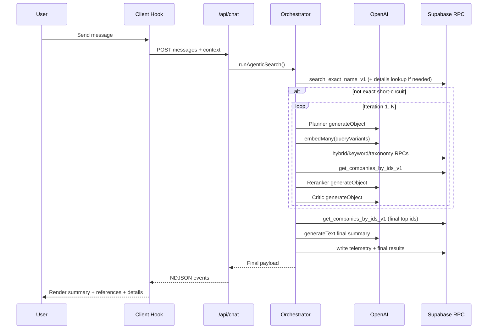

# Ceejay Search System Research

## Scope and Goal
This document explains the full runtime search flow in the `ceejay` app:
1. Request and streaming response lifecycle.
2. Agent orchestration steps and stopping logic.
3. All prompts, schemas, and model calls.
4. All Supabase RPCs and SQL scoring formulas.
5. Data contracts, telemetry, and UI integration.
6. Implementation notes and practical caveats.

Primary implementation files:
1. `src/app/api/chat/route.ts`
2. `src/hooks/use-agent-chat.ts`
3. `src/lib/agent/orchestrator.ts`
4. `src/lib/agent/prompts.ts`
5. `src/lib/agent/schemas.ts`
6. `src/lib/search/rpc.ts`
7. `src/lib/search/telemetry.ts`
8. `src/lib/search/taxonomy.ts`
9. `supabase/migrations/0001_agentic_search.sql`
10. `supabase/migrations/0002_rpc_type_fixes.sql`

## High-Level Architecture
Search is a server-orchestrated multi-step loop with LLM planning and reranking over Supabase retrieval.

1. Client sends chat transcript to `POST /api/chat`.
2. API calls `runAgenticSearch(...)`.
3. Orchestrator does:
1. Exact-name precheck.
2. Iterative plan -> embed -> retrieve -> filter -> rerank -> critic.
3. Final summary generation and response assembly.
4. API streams NDJSON events: activity updates, optional partial text, final answer.
5. Client renders assistant message, references, and side-panel company details.

## Entry Points and Runtime Contracts

### API endpoint
`src/app/api/chat/route.ts`:
1. Accepts body:
```ts
{
  messages: ChatMessage[];
  clientContext?: { previousCandidateIds?: string[] };
  sessionId?: string;
}
```
2. Uses `sessionId` from request or generates one.
3. Calls `runAgenticSearch` with callbacks:
1. `onActivity(event)` -> stream `{"type":"activity","data":...}`
2. `onPartialText(text)` -> stream `{"type":"partial_text","data":{"text":...}}`
4. On success emits:
```ts
{
  type: "final_answer",
  data: {
    content,
    references,
    companiesById,
    telemetry
  }
}
```
5. On failure emits:
```ts
{ type: "error", data: { message } }
```
6. Response content type: `application/x-ndjson; charset=utf-8`.

### Client hook behavior
`src/hooks/use-agent-chat.ts`:
1. Sends full message history to `/api/chat`.
2. Parses NDJSON line-by-line from stream reader.
3. Activity events update timeline entries by stable `id`.
4. Partial text is accumulated in memory.
5. Final answer appends assistant message and updates `companiesById`.
6. `previousCandidateIds` for next turn are set from returned references.
7. If no final content, client falls back to partial text or generic text.

## Environment and Dependencies

### Required env vars
`src/lib/env.ts` validates:
1. `OPENAI_API_KEY`
2. `OPENAI_MODEL` default `gpt-4o-mini`
3. `OPENAI_EMBEDDING_MODEL` default `text-embedding-3-small`
4. `SUPABASE_URL`
5. `SUPABASE_SERVICE_ROLE_KEY`

### Runtime SDKs
`package.json` dependencies used by search:
1. `ai` for `generateObject`, `generateText`, `embedMany`.
2. `@ai-sdk/openai` for model providers.
3. `@supabase/supabase-js` for RPC + telemetry table writes.
4. `zod` for strict JSON schema validation.

### Supabase client
`src/lib/supabase/server.ts`:
1. Uses service role key.
2. Disables session persistence and token refresh.
3. Caches client singleton process-wide.

## End-to-End Search Flow in `runAgenticSearch`
Main file: `src/lib/agent/orchestrator.ts`.

## 1) Initialization
1. Load env and Supabase client.
2. Extract latest user message from chat history.
3. Initialize loop state:
1. `iteration`
2. `toolCalls`
3. `priorTopIds` from client context
4. `previousBestScore`
4. Create telemetry run row in `search_runs` with `end_reason = in_progress`.

Guardrails (`LOOP_LIMITS`):
1. `maxIterations = 10`
2. `maxToolCalls = 40`
3. `maxRuntimeMs = 60000`

Thresholds:
1. Exact short-circuit: `0.95`
2. Anchor detection threshold: `0.8`

## 2) Exact-name precheck and anchor discovery
1. Detect similarity intent from user text via regex keywords:
1. `like`, `similar`, `competitor`, `alternative`, `vs`, `versus`, etc.
2. Extract candidate anchor names using:
1. Raw message
2. Quoted spans
3. Phrases after "like/similar to/competitor of/...".
4. Alphanumeric tokens containing letters and digits.
3. Clean and expand candidate strings (hyphen/stripped variants).
4. For each candidate call `search_exact_name_v1` with:
1. `statuses = ["startup"]`
2. `limit = 5`
5. Keep best score per company across candidate inputs.
6. If top exact match score >= `0.8`, fetch full company row by id.
7. If similarity intent is true:
1. Store this company as `anchorCompany`.
2. Continue into iterative similarity search.
8. Else if top exact score >= `0.95`:
1. Short-circuit search.
2. Return that single company as final top result with high confidence.

## 3) Iterative loop (if not exact short-circuit)
For each iteration up to `maxIterations`:
1. Stop early if runtime or tool-call guardrail already exceeded.
2. Planner step:
1. Build planner prompt with:
1. user message
2. summary of last 6 chat messages
3. previous top ids
4. full taxonomy prompt
5. searchable fields prompt
6. optional anchor company context
2. Call OpenAI `generateObject` with `plannerSchema`.
3. Normalize taxonomy fields to only allowed values.
4. If anchor exists, rewrite query variants:
1. remove placeholder variants like "companies similar to <anchor_name>"
2. append anchor-derived fallback queries from niche/category/sector/profile text
5. Embed step:
1. Deduplicate query variants and cap to 6.
2. Call `embedMany` on all query variants using embedding model.
6. Retrieval per query variant:
1. Hybrid RPC if enabled in plan and embedding exists.
2. Keyword RPC if enabled in plan.
3. Merge/aggregate candidates by company id with max score per signal.
7. Optional taxonomy retrieval:
1. Run only if plan includes taxonomy priority and sector/category/businessModel filters are non-empty.
2. Merge taxonomy signal into candidate map.
8. Details hydrate:
1. Sort by combined score.
2. Fetch top 80 company rows via `get_companies_by_ids_v1`.
9. Deterministic post-filtering:
1. Apply status, sector, category, business model constraints.
2. If `nicheMode = must_match`, enforce niche text inclusion.
3. Remove anchor company from candidate set.
4. Cap to top 40.
10. Reranker step:
1. Call OpenAI `generateObject` with `rerankerSchema`.
2. Reorder candidates by `rankedCompanyIds` from LLM.
3. Overlay per-company confidence/reason/evidence chips from LLM output.
11. Critic step:
1. Call OpenAI `generateObject` with `criticSchema`.
2. Inputs include top ids, top scores, and confidence.
12. Iteration stop/continue policy:
1. If critic says stop and reranker confidence >= `0.74`, end reason `confidence_met`.
2. Else if top-5 ids unchanged from previous iteration, end reason `converged`.
3. Else continue.
4. If critic adds new query variants, append and dedupe (stored up to 8; execution still capped to 6 next iteration).

## 4) Finalization
After loop:
1. If no final candidates:
1. Return "could not find confident match" message.
2. Finalize telemetry run with zero results.
2. Else:
1. Take top `targetResultCount` candidates (minimum 1).
2. Fetch final company rows by ids.
3. Generate final natural-language summary (2-3 sentences) via `generateText`.
4. Emit `onPartialText(summary.slice(0, 140))`.
5. Build references:
1. `companyId`, `companyName`, `inlineDescription`, `evidenceChips`, `confidence`.
2. Prefix evidence with `Similar to <anchor>` when anchor mode is active.
6. Persist run result rows into `search_run_results`.
7. Return final payload: summary content, references, hydrated `companiesById`, telemetry.

## Prompts and Schemas

### Exact system prompt literals
Planner system prompt:
```text
You are an agentic search planner for startup company discovery.
You must output strictly valid JSON.
Rules:
- Always produce multiple query variants when helpful.
- Default statuses to startup unless user asks otherwise.
- Use sectors/categories/business models only from taxonomy when provided.
- If query appears to be an exact company name, prioritize exact_name in searchPriorityOrder.
- For narrow-down instructions (only/just/exactly), set nicheMode to must_match when applicable.
- Always include all filter keys exactly: statuses, sectors, categories, businessModels, niches, nicheMode.
- Use empty arrays when a filter is not specified.
- If anchor company context is provided, first understand the anchor's business profile and generate similarity queries from its product/problem/niches, not from the company name string alone.
- Prefer query variants that target actual searchable fields (description, product_description, problem_solved, target_customer, differentiator, niches, sectors, categories, business_models).
```

Reranker system prompt:
```text
You are ranking company search candidates.
Return strictly valid JSON.
Prioritize precision and intent fit.
If exact name match exists, rank it first with high confidence.
```

Critic system prompt:
```text
You are a search loop critic.
Decide if another iteration is needed.
Return strictly valid JSON.
```

### Prompt builder templates
Planner prompt template (`buildPlannerPrompt`):
1. User message.
2. Conversation summary (`last 6 messages`, max 2200 chars).
3. Previous candidate ids.
4. Searchable fields list literal.
5. Allowed taxonomy block (all sectors/categories/models).
6. Anchor company context block or "None".
7. Explicit JSON output contract line and filter key requirements.
8. Anchor-specific query-variant instruction.

Reranker prompt template (`buildRerankerPrompt`):
1. User message.
2. Plan intent and target result count.
3. Up to first 30 candidates as JSON lines with:
1. `companyId`
2. `combinedScore`
3. `semanticScore`
4. `keywordScore`
5. `nicheScore`
6. `evidenceChips`
4. Explicit JSON output contract for confidence, ranked ids, and per-company reasons.

Critic prompt template (`buildCriticPrompt`):
1. User message.
2. Iteration number.
3. Candidate count.
4. Top scores.
5. Current confidence.
6. Previous top ids.
7. Current top ids.
8. Guidance for stop vs continue and optional query expansion.

### Planner
System prompt (`plannerSystemPrompt`) rules include:
1. Strict JSON only.
2. Multi-query variants.
3. Default status to startup.
4. Taxonomy values must come from provided lists.
5. Exact-name priority when applicable.
6. Always include full filter object keys.
7. Anchor-aware behavior: use anchor business profile, not company name string.
8. Prefer fields that exist in the dataset.

Planner output schema (`plannerSchema`):
1. `intent`: one of `discover | narrow | compare | find_company`
2. `targetResultCount`: int 1..20
3. `queryVariants`: 1..6 strings
4. `searchPriorityOrder`: array of `exact_name | hybrid | keyword | taxonomy`
5. `filters` object with required keys:
1. `statuses[]`
2. `sectors[]`
3. `categories[]`
4. `businessModels[]`
5. `niches[]`
6. `nicheMode: boost | must_match`
6. `successCriteria`: string

### Reranker
System prompt (`rerankerSystemPrompt`):
1. Strict JSON.
2. Prioritize precision/intent fit.
3. Promote exact-name match first when present.

Reranker output schema (`rerankerSchema`):
1. `confidence` in [0,1]
2. `rankedCompanyIds` (1..30 ids)
3. `perCompany[]` with:
1. `companyId`
2. `reason`
3. `inlineDescription`
4. `evidenceChips` up to 5
5. `confidence` in [0,1]

### Critic
System prompt (`criticSystemPrompt`):
1. Decide continue vs stop.
2. Strict JSON.

Critic output schema (`criticSchema`):
1. `decision`: `continue | stop`
2. `why`
3. `confidenceTargetMet`
4. `shouldExpandQueries`
5. `newQueryVariants` max 3

### Final summary prompt
Direct text generation prompt:
1. "Write a concise 2-3 sentence summary for this company search request: <userMessage>. Mention overall fit and confidence without listing every result."
2. No explicit system prompt for this final step.

## External Tools and APIs Used

### LLM API calls (OpenAI via AI SDK)
1. `generateObject` planner.
2. `embedMany` for query variants.
3. `generateObject` reranker.
4. `generateObject` critic.
5. `generateText` final summary.
6. No model-side function/tool calling is used; all "tool" execution is code-orchestrated RPC/SDK calls.

### Supabase RPC calls
Called from `src/lib/search/rpc.ts`:
1. `search_exact_name_v1`
2. `search_companies_hybrid_v1`
3. `search_companies_keyword_v1`
4. `search_companies_by_taxonomy_v1`
5. `get_companies_by_ids_v1`

### RPC argument map at orchestrator call sites
1. `search_exact_name_v1`:
1. `p_query_text` from extracted anchor candidate.
2. `p_statuses = ["startup"]`.
3. `p_limit = 5`.
2. `search_companies_hybrid_v1`:
1. `p_query_text` from query variant.
2. `p_query_embedding` from OpenAI embedding vector (1536 dims expected by SQL).
3. `p_statuses` from planner filters.
4. `p_include_ids = null` in current implementation.
5. `p_exclude_ids = [anchorId]` when anchor mode active else `[]`.
6. `p_limit = 120`.
7. `p_min_semantic = 0.25`.
3. `search_companies_keyword_v1`:
1. `p_query_text` from query variant.
2. `p_statuses` from planner filters.
3. `p_limit = 120`.
4. `search_companies_by_taxonomy_v1`:
1. `p_sectors` from planner filters or null.
2. `p_categories` from planner filters or null.
3. `p_business_models` from planner filters or null.
4. `p_statuses` from planner filters.
5. `p_limit = 500`.
5. `get_companies_by_ids_v1`:
1. Mid-loop hydration with ranked candidate ids.
2. Final hydration with top ids selected for response.

### Telemetry table writes
`src/lib/search/telemetry.ts`:
1. Insert run row in `search_runs`.
2. Insert step rows in `search_run_steps`.
3. Update run row on completion.
4. Insert final rows in `search_run_results`.

## SQL and Scoring Details
Defined in `supabase/migrations/0001_agentic_search.sql` and corrected return typing in `0002_rpc_type_fixes.sql`.

### DB extensions and indexes
1. `vector` extension for embeddings.
2. `pg_trgm` for fuzzy name matching.
3. Weighted full-text GIN expression index over `company_name`, `tagline`, `description`, `product_description`, `target_customer`, `problem_solved`, `differentiator`.
4. Trigram GIN index on `company_name`.
5. Index on `company_embeddings (embedding_type, company_id)`.

### `search_exact_name_v1`
1. Name score:
1. exact case-insensitive company-name equality -> 1.0
2. else trigram similarity
2. Candidate condition:
1. exact name equality
2. or trigram similarity >= 0.35
3. or website URL contains query text without spaces
3. Ordered by `name_score DESC`.

### `search_companies_hybrid_v1`
Inputs include query text, `VECTOR(1536)` embedding, status/include/exclude ids, limit, min semantic.

Per company signals:
1. `semantic_score = 1 - (embedding <=> query_embedding)` filtered by `>= p_min_semantic`.
2. `keyword_score = ts_rank(weighted_tsvector, websearch_to_tsquery(query))`.
3. `niche_score = ts_rank(niches_search, websearch_to_tsquery(query))`.

Combined score:
1. `combined = 0.58 * semantic + 0.27 * keyword + 0.15 * niche`.
2. `matched_fields` includes `semantic`, `keyword`, `niche` when each score > 0.

### `search_companies_keyword_v1`
Signals:
1. `keyword_score` from weighted tsvector rank.
2. `niche_score` from `niches_search` rank.

Combined score:
1. `combined = 0.85 * keyword + 0.15 * niche`.
2. Requires query text non-empty.

### `search_companies_by_taxonomy_v1`
1. Counts overlaps between company arrays and requested arrays:
1. `sector_hits`
2. `category_hits`
3. `model_hits`
2. `tag_score = sector_hits + category_hits + model_hits`.
3. Filter uses array overlap operators (`&&`) and status filter.
4. Ordered by `tag_score DESC`, then `company_name`.

### `get_companies_by_ids_v1`
1. Returns `SETOF companies` for input id array.
2. Used both mid-loop (hydrate candidates) and final response.

## Taxonomy Layer
`src/lib/search/taxonomy.ts` provides the planner-allowed taxonomy:
1. 15 sectors.
2. 12 categories per sector.
3. 18 business models.
4. `getTaxonomyPrompt()` serializes them into text for planner input.

Normalization behavior (`normalizeTaxonomy` in orchestrator):
1. Unknown sectors/categories/businessModels are dropped.
2. `statuses` defaults back to `["startup"]` if empty.
3. `niches` and `nicheMode` are preserved as planner supplied.

## Data Normalization and Contracts

### RPC row parsing
`src/lib/search/rpc.ts`:
1. Uses helper coercions for numeric and array outputs.
2. Embedding array converted to vector literal string for RPC argument.
3. `runRpc` throws explicit migration hint when return-type mismatch occurs.

### Company normalization
`src/lib/search/normalize.ts`:
1. Converts DB rows into strict `Company` object.
2. Parses JSON-encoded arrays/objects where needed.
3. Keeps nullable text fields and structured arrays for UI rendering.

### Final payload schema
Returned by `runAgenticSearch`:
```ts
{
  content: string;
  references: Array<{
    companyId: string;
    companyName: string;
    reason: string;
    inlineDescription: string;
    evidenceChips: string[];
    confidence: number;
  }>;
  companiesById: Record<string, Company>;
  telemetry: {
    runId: string;
    iterationCount: number;
    toolCallCount: number;
    endReason: "exact_match" | "confidence_met" | "converged" | "guardrail_hit" | "error";
  };
}
```

## Streaming and UI Rendering
1. The server sends NDJSON event lines in this order pattern:
1. zero or more `activity`
2. zero or one `partial_text`
3. one `final_answer` or one `error`
2. Activity timeline UI shows running/completed status with icons.
3. Assistant message displays returned references with chips and confidence.
4. Clicking a reference opens side panel with full company profile data from `companiesById`.

## Telemetry Observability Model

### Tables
1. `search_runs`: one row per request.
2. `search_run_steps`: ordered detailed trace per step.
3. `search_run_results`: final ranked outputs.

### Step names used by orchestrator
Examples:
1. `supabase.rpc.search_exact_name_v1`
2. `anchor.exact_name_precheck_summary`
3. `anchor.company_context`
4. `llm.plan_actions`
5. `llm.embed_query_batch`
6. `supabase.rpc.search_companies_hybrid_v1`
7. `supabase.rpc.search_companies_keyword_v1`
8. `supabase.rpc.search_companies_by_taxonomy_v1`
9. `supabase.rpc.get_companies_by_ids_v1`
10. `llm.rerank_candidates`
11. `llm.critic_continue_or_stop`
12. `llm.final_summary`

## Behavioral Notes and Caveats
1. `searchPriorityOrder` can include `exact_name`, but exact-name retrieval is only done in precheck before loop.
2. Exact-name precheck always uses `statuses = ["startup"]`, not planner status filters.
3. Planner may hold up to 8 query variants after critic expansion, but each iteration executes only first 6.
4. `niches` filter affects deterministic filtering only when `nicheMode = must_match`; there is no explicit "boost by niche list" stage.
5. `onPartialText` is emitted after final summary generation and only uses first 140 chars, so it is not token streaming.
6. Telemetry writes are best-effort; insert/update failures are logged and do not fail the request.
7. Service role key means backend bypasses user-level RLS constraints by design.
8. Taxonomy step telemetry currently logs `before` and `after` candidate counts as the same value, reducing observability fidelity for that step.

## Sequence Diagram


## Practical Debug Checklist
1. Confirm env vars parse in `getServerEnv`.
2. Confirm migrations `0001` then `0002` are applied.
3. Confirm `company_embeddings` rows exist with `embedding_type = searchable_profile`.
4. Inspect `search_runs` for `end_reason`, `tool_call_count`, `iteration_count`.
5. Inspect `search_run_steps` for failed tool entries and prompt summaries.
6. Validate that returned company ids exist in `companies` for detail hydration.
